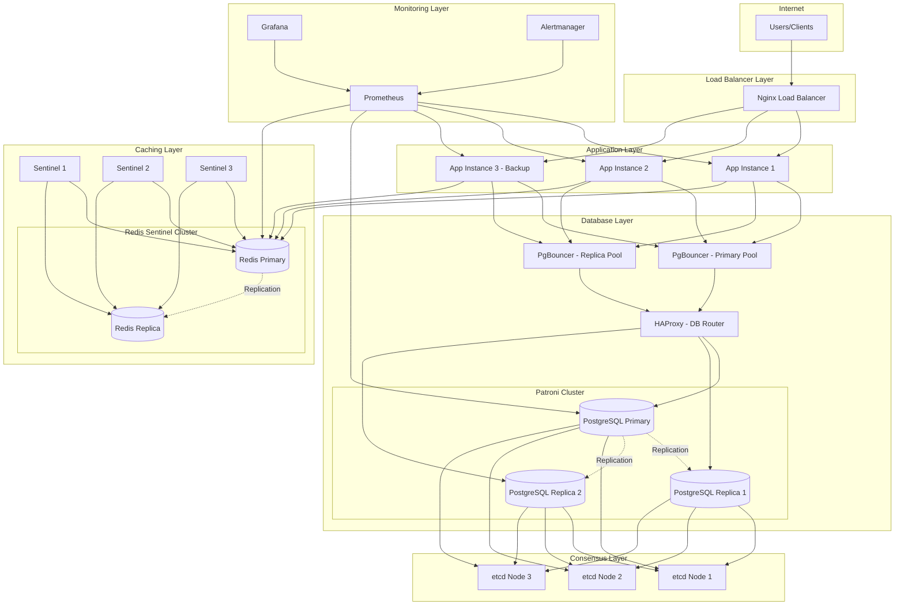

# Fleet2 High Availability Architecture

This document describes the high-availability (HA) architecture for Fleet2, including component redundancy, automatic failover mechanisms, health monitoring, and disaster recovery procedures.

## Table of Contents

- [Overview](#overview)
- [Architecture Diagram](#architecture-diagram)
- [Components](#components)
- [Failover Procedures](#failover-procedures)
- [Health Checks](#health-checks)
- [Monitoring](#monitoring)
- [Disaster Recovery](#disaster-recovery)
- [Runbooks](#runbooks)
- [Configuration Reference](#configuration-reference)

---

## Overview

### What High Availability Means for Fleet2

High availability ensures Fleet2 remains accessible and operational even when individual components fail. The architecture is designed to:

- **Eliminate single points of failure** - Every critical component has redundancy
- **Enable automatic failover** - Failed components are detected and bypassed automatically
- **Maintain data consistency** - Database replication ensures no data loss during failovers
- **Provide graceful degradation** - System continues operating at reduced capacity during partial failures

### Target Uptime SLA

| Tier | Target Uptime | Maximum Downtime/Year | Maximum Downtime/Month |
|------|---------------|----------------------|------------------------|
| Standard | 99.9% | 8h 45m | 43m |
| Enterprise | 99.95% | 4h 22m | 21m |
| Critical | 99.99% | 52m | 4m |

**Fleet2 Default Target: 99.95% uptime (Enterprise tier)**

### Key Metrics

| Metric | Target | Description |
|--------|--------|-------------|
| RTO (Recovery Time Objective) | 5-15 minutes | Maximum acceptable downtime |
| RPO (Recovery Point Objective) | < 5 minutes | Maximum acceptable data loss |
| Failover Time (Database) | < 30 seconds | Time to promote replica to primary |
| Failover Time (Application) | < 10 seconds | Time to route traffic away from failed instance |

---

## Architecture Diagram

### High-Level Architecture (Mermaid)



### ASCII Architecture Diagram

```
                                    ┌─────────────────────┐
                                    │    Users/Clients    │
                                    └──────────┬──────────┘
                                               │
                                    ┌──────────▼──────────┐
                                    │   Nginx Load        │
                                    │   Balancer          │
                                    │   (port 8280/8443)  │
                                    └──────────┬──────────┘
                                               │
                       ┌───────────────────────┼───────────────────────┐
                       │                       │                       │
              ┌────────▼────────┐     ┌────────▼────────┐     ┌────────▼────────┐
              │   App Instance  │     │   App Instance  │     │   App Instance  │
              │       #1        │     │       #2        │     │    #3 (Backup)  │
              │   (port 3000)   │     │   (port 3000)   │     │   (port 3000)   │
              └────────┬────────┘     └────────┬────────┘     └────────┬────────┘
                       │                       │                       │
           ┌───────────┴───────────────────────┴───────────────────────┘
           │
    ┌──────┴──────┐                                    ┌──────────────────┐
    │             │                                    │                  │
┌───▼───────┐ ┌───▼───────┐                       ┌────▼─────┐      ┌─────▼────┐
│ PgBouncer │ │ PgBouncer │                       │  Redis   │◄────►│  Redis   │
│  Primary  │ │  Replica  │                       │  Primary │ Repl │  Replica │
│ (64320)   │ │ (64321)   │                       └────┬─────┘      └──────────┘
└─────┬─────┘ └─────┬─────┘                            │
      │             │                           ┌──────┴──────┐
      └──────┬──────┘                           │             │
             │                             ┌────▼────┐   ┌────▼────┐   ┌─────────┐
      ┌──────▼──────┐                      │Sentinel1│   │Sentinel2│   │Sentinel3│
      │   HAProxy   │                      └─────────┘   └─────────┘   └─────────┘
      │  DB Router  │
      │ (5433/5434) │
      └──────┬──────┘
             │
    ┌────────┼────────┐
    │        │        │
┌───▼───┐ ┌──▼───┐ ┌──▼───┐     ┌────────────────────┐
│ Pat.1 │ │Pat.2 │ │Pat.3 │     │   etcd Cluster     │
│Primary│ │Repl. │ │Repl. │◄───►│ (Leader Election)  │
└───┬───┘ └──┬───┘ └──┬───┘     │ etcd1, etcd2, etcd3│
    │        │        │         └────────────────────┘
    │        │        │
    └────────┴────────┘
         Streaming
        Replication
```

---

## Components

### Application Layer

The application layer runs multiple Nuxt.js/Node.js instances behind a load balancer.

| Component | Instances | Purpose | Configuration |
|-----------|-----------|---------|---------------|
| Nginx | 1+ | Load balancing, SSL termination, static assets | `deploy/nginx/nginx.conf` |
| App Servers | 3 | Request handling, business logic | `docker-compose.ha.yml` |

**Load Balancing Strategy:**

- **Algorithm:** Least connections with health check awareness
- **Session Affinity:** Optional (via sticky sessions cookie)
- **Health Check:** HTTP GET `/api/health` every 30 seconds
- **Failure Detection:** 3 consecutive failures marks instance unhealthy
- **Recovery:** 2 consecutive successes marks instance healthy

**Application Configuration:**

```bash
# Environment variables for HA-aware application
NODE_ENV=production
INSTANCE_ID=app1                    # Unique identifier per instance

# Database connections (read/write split)
NUXT_DATABASE_URL=postgresql://...@pgbouncer-primary:6432/fleet
NUXT_DATABASE_READ_URL=postgresql://...@pgbouncer-replica:6432/fleet

# Redis with Sentinel
NUXT_REDIS_URL=redis://:password@redis-primary:6379
NUXT_REDIS_SENTINEL_HOSTS=sentinel1:26379,sentinel2:26379,sentinel3:26379
NUXT_REDIS_SENTINEL_NAME=fleet-redis
```

### Database Layer

Fleet2 uses PostgreSQL with Patroni for automatic failover and streaming replication.

| Component | Instances | Purpose | Ports |
|-----------|-----------|---------|-------|
| Patroni | 3 | PostgreSQL HA management, leader election | 5432, 8008 |
| HAProxy | 1 | Database connection routing | 5433 (primary), 5434 (replicas) |
| PgBouncer | 2 | Connection pooling | 64320 (primary), 64321 (replicas) |
| etcd | 3 | Distributed consensus, leader election | 2379, 2380 |

**PostgreSQL Configuration:**

| Parameter | Value | Purpose |
|-----------|-------|---------|
| `max_connections` | 200 | Maximum direct connections |
| `shared_buffers` | 256MB | Shared memory for caching |
| `wal_level` | replica | Required for replication |
| `max_wal_senders` | 10 | Maximum replication connections |
| `max_replication_slots` | 10 | Replication slot limit |
| `wal_keep_size` | 1GB | WAL retention for replicas |
| `hot_standby` | on | Allow read queries on replicas |
| `archive_mode` | on | Enable WAL archiving |

**Replication Topology:**

```
┌─────────────────────────────────────────────────────────────────┐
│                    PostgreSQL Cluster                           │
├──────────────────────┬──────────────────────┬───────────────────┤
│      Primary         │     Replica 1        │    Replica 2      │
│    (patroni1)        │    (patroni2)        │   (patroni3)      │
├──────────────────────┼──────────────────────┼───────────────────┤
│ Read/Write           │ Read-Only            │ Read-Only         │
│ WAL Generation       │ Streaming Replication│ Streaming Repl.   │
│ Failover Priority: 1 │ Failover Priority: 2 │ Failover Priority:3│
└──────────────────────┴──────────────────────┴───────────────────┘
```

**Connection Pooling (PgBouncer):**

| Parameter | Primary Pool | Replica Pool |
|-----------|--------------|--------------|
| `max_client_conn` | 500 | 1000 |
| `default_pool_size` | 25 | 50 |
| `pool_mode` | transaction | transaction |
| `query_timeout` | 300s | 120s |

### Caching Layer

Redis provides caching, session storage, and real-time features with Sentinel for HA.

| Component | Instances | Purpose |
|-----------|-----------|---------|
| Redis Primary | 1 | Write operations, session storage |
| Redis Replica | 1+ | Read operations, failover standby |
| Redis Sentinel | 3 | Monitoring, automatic failover |

**Redis Configuration:**

| Parameter | Value | Purpose |
|-----------|-------|---------|
| `maxmemory` | 512MB | Memory limit per instance |
| `maxmemory-policy` | allkeys-lru | Eviction policy |
| `appendonly` | yes | Persistence enabled |
| `requirepass` | [configured] | Authentication |

**Sentinel Failover:**

1. Sentinel monitors primary every 100ms
2. If primary unresponsive for `down-after-milliseconds` (30s), marked as SDOWN
3. Quorum of sentinels (2/3) confirms failure (ODOWN)
4. Leader sentinel promotes best replica to primary
5. Other replicas reconfigured to follow new primary
6. Clients notified via Sentinel protocol

### Load Balancing

Nginx provides Layer 7 load balancing with health checking.

**Nginx Upstream Configuration:**

```nginx
upstream fleet_app {
    least_conn;

    server app1:3000 weight=1 max_fails=3 fail_timeout=30s;
    server app2:3000 weight=1 max_fails=3 fail_timeout=30s;
    server app3:3000 weight=1 max_fails=3 fail_timeout=30s backup;

    keepalive 32;
}
```

---

## Failover Procedures

### Automatic Failover Triggers

| Component | Trigger Condition | Detection Time | Failover Time |
|-----------|-------------------|----------------|---------------|
| App Instance | 3 failed health checks | 90 seconds | Immediate |
| PostgreSQL Primary | Patroni leader timeout | 10-30 seconds | 10-30 seconds |
| PostgreSQL Replica | Replication lag > 30s | 30 seconds | N/A (degraded) |
| Redis Primary | Sentinel quorum + timeout | 30 seconds | 10-20 seconds |

### Database Automatic Failover (Patroni)

Patroni handles database failover automatically:

1. **Detection**: etcd heartbeat timeout (10 seconds default)
2. **Leader Lock Release**: Primary's etcd lock expires
3. **Election**: Replicas compete for leader lock
4. **Promotion**: Winner promotes itself to primary
5. **Reconfiguration**: Remaining replicas follow new primary
6. **HAProxy Update**: Health checks detect new primary

**Monitoring Patroni Status:**

```bash
# Check cluster status via Patroni REST API
curl http://patroni1:8008/cluster | jq .

# Check specific node status
curl http://patroni1:8008/patroni | jq .

# Check current leader
curl http://patroni1:8008/leader

# Via HAProxy stats
curl http://haproxy:8404/stats
```

### Manual Failover Steps

#### Planned PostgreSQL Failover (Maintenance)

```bash
# 1. Check current cluster status
curl http://patroni1:8008/cluster | jq .

# 2. Identify desired new leader
TARGET_NODE="patroni2"

# 3. Perform switchover (graceful failover)
curl -XPOST http://patroni1:8008/switchover \
  -H "Content-Type: application/json" \
  -d "{\"leader\": \"patroni1\", \"candidate\": \"$TARGET_NODE\"}"

# 4. Verify switchover completed
curl http://patroni1:8008/cluster | jq .

# 5. Verify application connectivity
curl http://app1:3000/api/health
```

#### Emergency PostgreSQL Failover

```bash
# Force failover when primary is unresponsive
# WARNING: This may cause brief write unavailability

# 1. Connect to any healthy Patroni node
curl -XPOST http://patroni2:8008/failover \
  -H "Content-Type: application/json" \
  -d '{"candidate": "patroni2"}'

# 2. Verify new primary is accepting writes
psql -h haproxy -p 5433 -U fleet -d fleet -c "SELECT pg_is_in_recovery();"
# Should return 'f' (false) for primary
```

#### Redis Manual Failover

```bash
# 1. Connect to any Sentinel
redis-cli -h sentinel1 -p 26379

# 2. Check master status
SENTINEL master fleet-redis

# 3. Force failover
SENTINEL failover fleet-redis

# 4. Verify new master
SENTINEL get-master-addr-by-name fleet-redis
```

### Recovery Procedures

#### Recovering a Failed PostgreSQL Node

```bash
# 1. Check node status
docker logs fleet-patroni1

# 2. If data is intact, restart the container
docker compose restart patroni1

# 3. Patroni will automatically reinitialize as replica
# Monitor progress
curl http://patroni1:8008/patroni | jq .

# 4. If data is corrupted, rebuild from scratch
docker compose stop patroni1
docker volume rm fleet2_patroni1_data
docker compose up -d patroni1
# Patroni will perform pg_basebackup from primary
```

#### Recovering from Split-Brain (Rare)

```bash
# 1. Identify the true primary (most recent data)
for node in patroni1 patroni2 patroni3; do
  echo "=== $node ==="
  curl -s "http://$node:8008/patroni" | jq '.xlog.location'
done

# 2. Stop all Patroni nodes
docker compose stop patroni1 patroni2 patroni3

# 3. Start only the true primary
docker compose up -d patroni1  # or whichever is correct

# 4. Reinitialize other nodes
docker volume rm fleet2_patroni2_data fleet2_patroni3_data
docker compose up -d patroni2 patroni3
```

---

## Health Checks

### Health Check Endpoints

| Component | Endpoint | Method | Expected Response | Interval |
|-----------|----------|--------|-------------------|----------|
| Application | `/api/health` | GET | 200 OK | 30s |
| Patroni | `:8008/health` | GET | 200 OK | 10s |
| Patroni (Primary) | `:8008/primary` | GET | 200 OK | 3s |
| Patroni (Replica) | `:8008/replica` | GET | 200 OK | 3s |
| Redis | `PING` | Redis CMD | PONG | 10s |
| etcd | `/health` | GET | 200 OK | 10s |
| HAProxy | `:8405/health` | GET | 200 OK | 10s |

### Application Health Check Response

```json
{
  "status": "healthy",
  "timestamp": "2025-01-15T10:30:00.000Z",
  "version": "1.2.3",
  "instance": "app1",
  "checks": {
    "database": {
      "status": "healthy",
      "latency_ms": 5
    },
    "redis": {
      "status": "healthy",
      "latency_ms": 2
    },
    "memory": {
      "status": "healthy",
      "used_mb": 512,
      "limit_mb": 1024
    }
  }
}
```

### Health Check Intervals and Thresholds

| Check Type | Interval | Timeout | Unhealthy After | Healthy After |
|------------|----------|---------|-----------------|---------------|
| Load Balancer -> App | 30s | 10s | 3 failures | 2 successes |
| HAProxy -> Patroni | 3s | 2s | 3 failures | 2 successes |
| Patroni -> etcd | 10s | 5s | 3 failures | N/A |
| Sentinel -> Redis | 100ms | N/A | 30s unresponsive | N/A |

### Alert Thresholds

| Metric | Warning Threshold | Critical Threshold |
|--------|-------------------|-------------------|
| Response Time (p95) | > 2 seconds | > 5 seconds |
| Error Rate | > 5% | > 10% |
| CPU Usage | > 80% | > 95% |
| Memory Usage | > 85% | > 95% |
| Disk Usage | > 80% | > 90% |
| DB Connection Pool | > 80% utilization | > 95% utilization |
| Replication Lag | > 10 seconds | > 60 seconds |
| Healthy Instances | < 3 | < 2 |

---

## Monitoring

### Key Metrics to Watch

#### Application Metrics

| Metric | Description | Alert Condition |
|--------|-------------|-----------------|
| `http_requests_total` | Total HTTP requests | Rate change > 100% |
| `http_request_duration_seconds` | Request latency histogram | p95 > 2s |
| `http_requests_errors_total` | Error responses (5xx) | Rate > 10% |
| `nodejs_heap_size_bytes` | Node.js heap memory | > 90% of limit |
| `db_connections_active` | Active DB connections | > 80% of pool |

#### Database Metrics

| Metric | Description | Alert Condition |
|--------|-------------|-----------------|
| `pg_up` | Database availability | == 0 |
| `pg_replication_lag_seconds` | Replication delay | > 30 seconds |
| `pg_stat_activity_count` | Active connections | > 80% of max |
| `pg_database_size_bytes` | Database size | > 80% of disk |
| `pg_slow_queries` | Queries > 1s | > 10 per minute |

#### Redis Metrics

| Metric | Description | Alert Condition |
|--------|-------------|-----------------|
| `redis_up` | Redis availability | == 0 |
| `redis_connected_clients` | Client connections | > 80% of max |
| `redis_used_memory_bytes` | Memory usage | > 90% of maxmemory |
| `redis_evicted_keys_total` | Cache evictions | > 100 per minute |
| `redis_connected_slaves` | Replica count | < expected |

### Alerting Configuration

Alerts are configured in `deploy/monitoring/prometheus.yml` and routed via Alertmanager.

**Alert Severity Levels:**

| Level | Response Time | Notification Channel | Examples |
|-------|---------------|---------------------|----------|
| Critical | Immediate | PagerDuty, SMS, Slack | All instances down, database unreachable |
| Warning | 30 minutes | Slack, Email | High latency, degraded capacity |
| Info | Next business day | Email, Dashboard | Deployments, certificate expiry |

**Alertmanager Routing Example:**

```yaml
route:
  receiver: 'default'
  group_by: ['alertname', 'severity']
  group_wait: 30s
  group_interval: 5m
  repeat_interval: 4h
  routes:
    - match:
        severity: critical
      receiver: 'pagerduty-critical'
      continue: true
    - match:
        severity: warning
      receiver: 'slack-warnings'
```

### Dashboards

Pre-configured Grafana dashboards are available in `deploy/monitoring/grafana/dashboards/`:

| Dashboard | Description | Key Panels |
|-----------|-------------|------------|
| Fleet2 Overview | Application health summary | Request rate, error rate, latency percentiles |
| Infrastructure | System resources | CPU, memory, disk, network per container |
| PostgreSQL | Database performance | Connections, replication lag, query latency |
| Redis | Cache performance | Hit rate, memory, evictions |
| HA Status | Cluster health | Instance status, failover events |

---

## Disaster Recovery

### Backup Procedures

See [backup-configuration.md](./backup-configuration.md) for detailed backup configuration.

**Backup Summary:**

| Backup Type | Schedule | Retention | Storage | RPO |
|-------------|----------|-----------|---------|-----|
| WAL Archive | Continuous | 7 days | S3 | < 5 minutes |
| Daily Full | 02:00 UTC | 7 days | S3 | 24 hours |
| Weekly Full | Sunday 03:00 UTC | 28 days | S3 | 7 days |
| Monthly Full | 1st of month 04:00 UTC | 365 days | S3/Glacier | 30 days |

### Recovery Time Objectives (RTO)

| Scenario | RTO Target | RTO Maximum | Procedure |
|----------|------------|-------------|-----------|
| Single app instance failure | 30 seconds | 2 minutes | Automatic (load balancer) |
| Database failover | 30 seconds | 5 minutes | Automatic (Patroni) |
| Redis failover | 20 seconds | 2 minutes | Automatic (Sentinel) |
| Single AZ failure | 5 minutes | 15 minutes | Automatic + DNS update |
| Full database restore | 30 minutes | 2 hours | Manual (PITR) |
| Complete infrastructure rebuild | 2 hours | 8 hours | Manual (IaC + restore) |

### Recovery Point Objectives (RPO)

| Data Type | RPO | Method |
|-----------|-----|--------|
| Transactional Data | < 5 minutes | Synchronous replication + WAL |
| Session Data | 0 (real-time) | Redis replication |
| Uploaded Files | < 1 hour | S3 versioning |
| Audit Logs | < 5 minutes | WAL archiving |

### Cross-Region Disaster Recovery

For critical deployments, configure cross-region replication:

```
Primary Region (us-east-1)          DR Region (us-west-2)
┌────────────────────┐              ┌────────────────────┐
│  Production Stack  │              │    Standby Stack   │
│  - 3 App Instances │              │  - 1 App Instance  │
│  - 3 PostgreSQL    │───WAL Copy──►│  - 1 PostgreSQL    │
│  - Redis Cluster   │              │  - Redis Replica   │
└────────────────────┘              └────────────────────┘
```

**DR Activation Steps:**

1. Verify primary region is truly unavailable
2. Promote DR database to primary
3. Update DNS to point to DR region
4. Scale DR application instances
5. Notify users of potential data loss window

---

## Runbooks

### Runbook 1: Database Failover

**Trigger:** PostgreSQL primary is unresponsive

**Automatic Response:**
1. Patroni detects primary failure via etcd heartbeat (10s)
2. etcd leader lock expires (30s TTL)
3. Remaining replicas compete for leader election
4. Winner promotes to primary (< 5s)
5. HAProxy health checks detect new primary (3s interval)
6. Application connections routed to new primary

**Manual Verification:**

```bash
# 1. Check Patroni cluster status
curl http://localhost:8008/cluster | jq '.'

# Expected output shows new leader
# {
#   "members": [
#     {"name": "patroni2", "role": "leader", "state": "running"},
#     {"name": "patroni1", "role": "replica", "state": "stopped"},
#     {"name": "patroni3", "role": "replica", "state": "running"}
#   ]
# }

# 2. Verify application health
curl http://localhost:3000/api/health

# 3. Check replication status
psql -h haproxy -p 5433 -U fleet -d fleet -c "SELECT * FROM pg_stat_replication;"

# 4. Monitor for any connection errors
tail -f /var/log/fleet2/app.log | grep -i "database\|connection"
```

**Recovery of Failed Node:**

```bash
# Option A: Node recovers on its own
# Patroni will automatically rejoin as replica

# Option B: Data is corrupted - rebuild
docker compose stop patroni1
docker volume rm fleet2_patroni1_data
docker compose up -d patroni1
# Monitor rebuild progress
watch 'curl -s http://localhost:8008/cluster | jq .'
```

### Runbook 2: App Instance Failure

**Trigger:** Application instance health check failing

**Automatic Response:**
1. Nginx detects failed health checks (3 consecutive)
2. Instance marked unhealthy (90 seconds total)
3. Traffic routed to healthy instances
4. Container restart attempted (Docker restart policy)

**Manual Verification:**

```bash
# 1. Check container status
docker ps -a | grep fleet-app

# 2. Check container logs
docker logs --tail 100 fleet-app1

# 3. Check health endpoint directly
curl -v http://localhost:3000/api/health

# 4. Check resource usage
docker stats fleet-app1 fleet-app2 fleet-app3
```

**Manual Recovery:**

```bash
# Restart failed instance
docker compose restart app1

# If persistent failure, recreate container
docker compose up -d --force-recreate app1

# If image is corrupted, rebuild
docker compose build app
docker compose up -d app1

# Scale horizontally if needed
docker compose up -d --scale app=4
```

### Runbook 3: Full Site Recovery

**Trigger:** Complete infrastructure failure (region outage, data center loss)

**Prerequisites:**
- Access to S3 backup bucket
- Infrastructure-as-code templates
- DR region credentials

**Recovery Steps:**

```bash
# 1. Provision new infrastructure
cd infrastructure/terraform
terraform init
terraform workspace new recovery
terraform apply -target=module.networking
terraform apply -target=module.database
terraform apply

# 2. Restore database from backup
# Download latest backup
aws s3 cp s3://fleet2-backups/fleet2/daily/latest/ /tmp/backup/ --recursive

# Restore using PITR script
./deploy/scripts/pitr-restore.sh \
    -b /tmp/backup/base.tar.gz \
    -s fleet2-backups \
    --target-latest

# 3. Verify database restoration
psql -h localhost -U fleet -d fleet -c "SELECT COUNT(*) FROM organisations;"

# 4. Deploy application stack
docker compose -f docker-compose.yml -f deploy/ha/docker-compose.ha.yml up -d

# 5. Run smoke tests
./scripts/smoke-test.sh production

# 6. Update DNS to point to new infrastructure
# (Manual step - depends on DNS provider)

# 7. Verify end-to-end functionality
curl -v https://app.fleet2.com/api/health

# 8. Monitor for 30 minutes
watch 'curl -s https://app.fleet2.com/api/health | jq .'

# 9. Post-recovery tasks
# - Notify stakeholders
# - Document incident timeline
# - Schedule post-mortem
```

### Runbook 4: Redis Failover

**Trigger:** Redis primary is unresponsive

**Automatic Response:**
1. Sentinel detects primary failure (30s)
2. Sentinels reach quorum (2/3)
3. Leader sentinel coordinates failover
4. Replica promoted to primary
5. Clients receive new primary address

**Manual Verification:**

```bash
# 1. Check Sentinel status
redis-cli -h sentinel1 -p 26379 SENTINEL master fleet-redis

# 2. Get current master address
redis-cli -h sentinel1 -p 26379 SENTINEL get-master-addr-by-name fleet-redis

# 3. Verify application connectivity
curl http://localhost:3000/api/health | jq '.checks.redis'

# 4. Check replication status
redis-cli -h redis-primary -a $REDIS_PASSWORD INFO replication
```

**Manual Failover:**

```bash
# Force failover to specific replica
redis-cli -h sentinel1 -p 26379 SENTINEL failover fleet-redis

# Monitor failover progress
redis-cli -h sentinel1 -p 26379 SENTINEL master fleet-redis
```

---

## Configuration Reference

### Starting the HA Stack

```bash
# Start full HA stack
docker compose -f docker-compose.yml -f deploy/ha/docker-compose.ha.yml up -d

# Check status
docker compose ps

# View logs
docker compose logs -f

# Monitor Patroni cluster
watch 'curl -s http://localhost:8008/cluster | jq .'

# View HAProxy stats
open http://localhost:8404/stats
```

### Environment Variables

| Variable | Description | Default |
|----------|-------------|---------|
| `POSTGRES_USER` | PostgreSQL superuser | fleet |
| `POSTGRES_PASSWORD` | PostgreSQL password | (required) |
| `REPLICATION_USER` | Replication user | replicator |
| `REPLICATION_PASSWORD` | Replication password | (required) |
| `REDIS_PASSWORD` | Redis authentication | (required) |
| `SESSION_PASSWORD` | Application session secret | (required) |
| `PGBOUNCER_PRIMARY_PORT` | PgBouncer primary pool port | 64320 |
| `PGBOUNCER_REPLICA_PORT` | PgBouncer replica pool port | 64321 |
| `HAPROXY_PG_PRIMARY_PORT` | HAProxy primary port | 54330 |
| `HAPROXY_PG_REPLICA_PORT` | HAProxy replica port | 54331 |
| `NGINX_HTTP_PORT` | Nginx HTTP port | 8280 |
| `NGINX_HTTPS_PORT` | Nginx HTTPS port | 8443 |

### Configuration Files

| File | Purpose |
|------|---------|
| `deploy/ha/docker-compose.ha.yml` | HA stack definition |
| `deploy/ha/patroni.yml` | Patroni configuration |
| `deploy/ha/haproxy-pg.cfg` | HAProxy PostgreSQL routing |
| `deploy/ha/pgbouncer.ini` | Connection pooling settings |
| `deploy/ha/etcd.env` | etcd cluster configuration |
| `deploy/ha/sentinel.conf` | Redis Sentinel configuration |
| `deploy/nginx/nginx.conf` | Load balancer configuration |

### Resource Requirements

| Component | CPU (Limit) | Memory (Limit) | Storage |
|-----------|-------------|----------------|---------|
| Patroni (x3) | 2 cores | 2 GB | 100 GB SSD |
| etcd (x3) | 0.5 cores | 256 MB | 10 GB SSD |
| PgBouncer (x2) | 0.5 cores | 256 MB | - |
| HAProxy | 0.5 cores | 128 MB | - |
| Redis Primary | 1 core | 768 MB | 10 GB SSD |
| Redis Replica | 1 core | 768 MB | 10 GB SSD |
| Sentinel (x3) | 0.25 cores | 64 MB | - |
| App Instance (x3) | 2 cores | 1 GB | - |
| Nginx | 1 core | 256 MB | 1 GB (logs) |
| **Total Minimum** | **~15 cores** | **~12 GB** | **~350 GB** |

---

## Appendix

### Related Documentation

- [Disaster Recovery Runbook](./disaster-recovery-runbook.md) - Detailed DR procedures
- [Backup Configuration](./backup-configuration.md) - Backup setup and verification
- [Monitoring Setup](./monitoring-setup.md) - Prometheus, Grafana, alerting
- [Admin Guide](./admin-guide.md) - General administration tasks

### External References

- [Patroni Documentation](https://patroni.readthedocs.io/)
- [HAProxy Configuration Manual](https://www.haproxy.com/documentation/haproxy-configuration-manual/)
- [Redis Sentinel Documentation](https://redis.io/docs/management/sentinel/)
- [etcd Operations Guide](https://etcd.io/docs/v3.5/op-guide/)
- [PgBouncer Documentation](https://www.pgbouncer.org/usage.html)

### Revision History

| Version | Date | Author | Changes |
|---------|------|--------|---------|
| 1.0 | 2025-01-01 | Platform Team | Initial version |

---

**Document Owner:** Platform Team
**Last Review:** 2025-01-01
**Next Review:** 2025-04-01

*This document is critical for operational continuity. Keep it up to date and accessible to all on-call engineers.*
